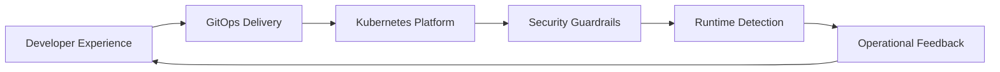

# Praveen Bhat

### Senior Platform Engineer | DevSecOps | Kubernetes | GitOps | Cloud Infrastructure

I build secure, production-grade cloud platforms that make delivery faster, operations calmer, and security easier to prove.

  
  
  

---

## What I Do

I am a Senior Platform and DevSecOps Engineer with 17+ years of experience across cloud infrastructure, Kubernetes platforms, GitOps delivery, automation, and security engineering.

My strongest work sits at the intersection of:

- Kubernetes platform engineering across EKS, GKE, AKS, and OpenShift
- Terraform-based infrastructure platforms with reusable modules and CI validation
- GitOps operating models with Argo CD, Helm, policy controls, and drift detection
- DevSecOps guardrails with Kyverno, OPA Gatekeeper, Trivy, Kubescape, Falco, and kube-bench
- Incident response, reliability engineering, observability, and operational automation

## Portfolio Highlights

| Project | What It Demonstrates | Stack |
| --- | --- | --- |
| [terraform-eks-platform](https://github.com/praveenbhatk8s/terraform-eks-platform) | Production-style EKS foundation with VPC, node groups, Karpenter, add-ons, and Terraform CI | Terraform, AWS, EKS, Karpenter, GitHub Actions |
| [argocd-gitops-platform](https://github.com/praveenbhatk8s/argocd-gitops-platform) | App-of-apps GitOps delivery platform with Helm workloads and automated reconciliation | Argo CD, Helm, Kubernetes, GitOps |
| [kubernetes-security-hardening](https://github.com/praveenbhatk8s/kubernetes-security-hardening) | Kubernetes security lab covering admission control, runtime detection, scanning, and hardening tests | Kyverno, Gatekeeper, Falco, Trivy, Kubescape |
| [agentic-sre-platform](https://github.com/praveenbhatk8s/agentic-sre-platform) | Agentic incident triage workflow with guardrails and Kubernetes remediation hooks | Python, FastAPI, Kubernetes, SRE automation |

## Technical Depth

**Cloud and Platform**

**Infrastructure and Delivery**

**Security and Reliability**

## Architecture Mindset

The goal is not just infrastructure that works. The goal is infrastructure that teams can understand, operate, secure, and improve.

## Certifications

- Certified Kubernetes Security Specialist
- Certified Kubernetes Administrator
- Certified Kubernetes Application Developer
- Red Hat Certified System Administrator
- Red Hat OpenShift Administration
- ITIL V3 Certified
- CCNA equivalent certification from HughesNet

## Current Focus

- Platform engineering roles at Senior, Lead, Staff, or Principal level
- Kubernetes and GitOps platform ownership
- DevSecOps transformation and cloud security hardening
- Internal developer platforms and operational automation

## Contact

- LinkedIn: [linkedin.com/in/praveen-bhat-99923111](https://www.linkedin.com/in/praveen-bhat-99923111)
- Email: [prav.bh@gmail.com](mailto:prav.bh@gmail.com)
- Location: Germany

---

> Build platforms developers love, security teams trust, and businesses can scale on.
